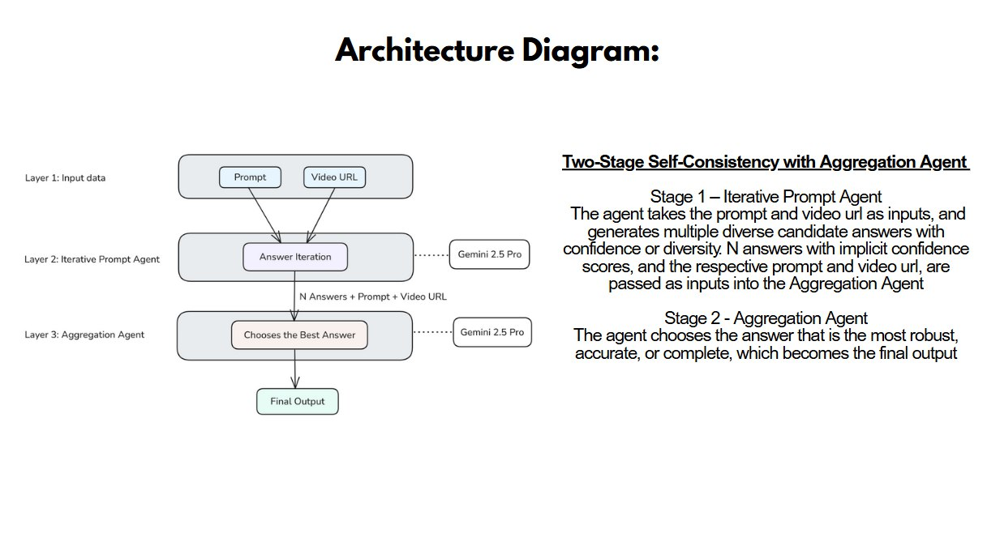

# Team: Sherlin's Squad

- Sherlin Choo (Team Leader)
- Ang Jia Yi (Developer)
- Chloe Ong (Developer)
- Eunice Lor (Developer)
- Gabriel Wong (Developer)

## Abstract

This project implements an asynchronous pipeline featuring an **agentic workflow** for advanced Question Answering (QA) on diverse, short-form videos sourced from the `https://huggingface.co/datasets/lmms-lab/AISG_Challenge` on Hugging Face. The system utilizes Google's Gemini 2.5 Pro model as the core reasoning engine, orchestrated primarily by the `CotAgent`.

For each video-question pair, the `CotAgent` leverages the `GeminiAsync` class to execute a structured, multi-step reasoning process, inspired by the proposed algorithm from [Self-Consistency improves Chain of Thought reasoning in Language Models](https://arxiv.org/abs/2203.11171) as well as the proposed multi agent algorithm [Sequential workflow agent pattern design](https://microsoft.github.io/autogen/stable/user-guide/core-user-guide/design-patterns/sequential-workflow.html):

1.  **Candidate Answer Generation:** Gemini is first prompted using detailed instructions and few-shot examples (`use_context` prompt) to analyze the video and generate multiple high-confidence candidate answers relevant to the specific question.
2.  **Answer Selection & Synthesis:** Gemini is then prompted again (`choose_best_answer_prompt`), this time tasked with analyzing the previously generated candidate answers. It selects the most appropriate response or synthesizes a final answer based on the candidates, applying specific heuristics for different question formats (e.g., multiple-choice).

This agentic, multi-prompt approach aims to enhance the depth, reasoning quality, and accuracy of the generated answers compared to simpler, single-shot prompting, enabling a more nuanced understanding of the video content. The asynchronous nature of the pipeline ensures efficient processing.

## Features

- **Gemini 2.5 Pro Integration:** Utilizes the state-of-the-art multimodal model for core video understanding and QA.
- **Chain-of-Thought Inspired QA:** Implements a multi-step process within the `CotAgent`:
  - Generates multiple candidate answers using nuanced prompting (`use_context`).
  - Selects/crafts the optimal answer from candidates using dedicated logic (`choose_best_answer_prompt`), including specific handling for multiple-choice questions.
- **Asynchronous Processing:** Leverages `asyncio` for efficient handling of API calls and potential parallel processing.
- **Hugging Face Dataset Integration:** Designed to load video metadata and questions directly from the `lmms-lab/tiktok_mllm_dataset`.
- **Checkpointing & Retries:** Includes mechanisms within the `CotAgent` to save progress and retry questions that failed on the initial run.
- **Configuration:** Allows basic configuration of API keys via `.env` and pipeline parameters within `main.py`.

### Roadmap (Planned Features)

- **Enhanced Perception:** Integration of more robust visual analysis techniques (potentially external CV models or refined LLM prompting) to improve accuracy on fine-grained visual events.
- **Improved Fact-Checking:** Re-integration or enhancement of the fact-checking loop to further validate and refine generated answers.
- **Advanced Error Handling:** More granular error handling and reporting throughout the pipeline.
- **Configuration Management:** Externalize more parameters from `main.py` into a dedicated configuration file (e.g., YAML).

## Architecture Diagram



## Tech Stack

- **Core:** Python 3.10+
- **AI/ML:**
  - Google Generative AI SDK (`google-genai`) for Gemini 2.5 Pro API. To prevent Error 429 Rate Limit Exceeded, it is recommended that you have a Tier 2 Gemini API key.
- **Data Handling:**
  - Hugging Face `datasets` library
  - `pandas`
- **Utilities:**
  - `python-dotenv` (Environment variables)
  - `tqdm` (Progress bars)
  - `asyncio` (Asynchronous operations)

## Installation Instructions

Follow these steps to set up the project locally:

1.  **Clone the repository:**

    ```bash
    git clone https://github.com/ajiayi-debug/tiktokmllm.git
    cd tiktokmllm
    ```

2.  **Create and activate a Python virtual environment:**

    ```bash
    # Ensure you have Python 3.10+ installed
    python -m venv venv
    # On Windows:
    venv\Scripts\activate
    # On macOS/Linux:
    source venv/bin/activate
    ```

3.  **Install dependencies:**

    ```bash
    pip install -r requirements.txt
    ```

    _(This installs libraries like `google-generativeai`, `pandas`, `datasets`, etc.)_

4.   **Install Video Dataset**
    - Download the video dataset from Hugging Face: https://huggingface.co/datasets/lmms-lab/AISG_Challenge/blob/main/Benchmark-AllVideos-HQ-Encoded-challenge.zip and place the folder into the root directory.

5.   **Configure API Keys:**
    - Create a file named `.env` in the project root directory (`tiktokmllm`).
    - Add your Google Gemini API key to this file:
      ```dotenv
      GEMINI_API_KEY="YOUR_GEMINI_API_KEY_HERE"
      ```
    - **Note:** Ensure your Gemini API key has sufficient quota. **Tier 2 access (or higher) is recommended** to avoid frequent `429 Rate Limit Exceeded` errors when processing many videos/questions.
     
## Usage Guide

The pipeline is executed via the `main.py` script located in the project root.

**Running the Pipeline:**

1.  Activate your virtual environment (`source venv/bin/activate` or `venv\Scripts\activate`).
2.  Ensure your `.env` file with the `GEMINI_API_KEY` is present in the root directory.
3.  Run the script from the project root:
    ```bash
    python main.py
    ```

The script will load the dataset, process videos and questions through the `CotAgent`, log progress to the console and `pipeline.log`, and save checkpoints and final results to the `data/` directory.

## Configuration

- **API Keys:** Configure your `GEMINI_API_KEY` in the `.env` file.
- **Pipeline Parameters:** Key parameters like the number of candidate generation iterations (N) (`iteration`), API call wait times (`wait_time`), and output file naming conventions can be modified directly within `main.py`. We found that N=32 performs the most optimally in terms of improvements in accuracy.
- **Model:** The specific Gemini model used (`gemini-2.5-pro-preview-03-25`) is set within `agents/cot_agent/gemini.py`.

## Deployment Instructions

- **Current Method:** The primary method for running the pipeline is local execution via `python main.py` after completing the setup.
- **Future Considerations:** For more scalable or portable deployments:
  - **Containerization:** Package the application using Docker for easier environment management and deployment.
  - **Cloud Execution:** Adapt the script to run on cloud platforms (e.g., Google Cloud Vertex AI, AWS SageMaker) for access to more powerful compute resources and better integration with cloud storage and APIs. This would likely involve modifications for data loading/saving and potentially using cloud-native services for task orchestration.

## Acknowledgements

- Google Gemini API & Team
- Hugging Face `datasets` library
- Pandas, python-dotenv, tqdm library creators
